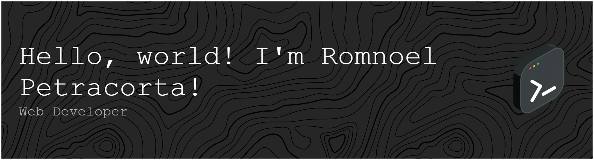

I'm a passionate programmer and a web developer. My journey into tech began with a love for video games starting with Dark Souls. That curiositiy about how games are built sparked my interest in programming, eventually leading me to pursue my Computer Science degree at New Era University.

## Education
**Elementary**
- FEU Roosevelt Rodriguez (Formerly known as Roosevelt College Rodriguez) (2010–2013)
- San Jose Elementary School (2013–2016)

**Highschool**
- San Jose National High School (2016–2020)

**Senior Highschool** 
- Valley High Academy (2020–2022)

**College**
- *BS in Computer Science*
- New Era University (2022–Present)

## Certifications
- [SQL and Relational Databases 101](https://courses.cognitiveclass.ai/certificates/b6b530cd67e74fc7826e640ebbe05917)
- [Cisco - Introduction to Data Science](https://www.credly.com/badges/3310a7e8-0515-494d-ab83-47afb62312e3/public_url)
- [Oracle Cloud Infrastructure 2023 AI Certified Foundations Associate](https://catalog-education.oracle.com/pls/certview/sharebadge?id=2D0C5AEEEB45095D294ED35244D18FB29C5477429B89B7211E228D1955F52165)
- [Oracle Cloud Data Management 2023 Certified Foundations Associate](https://catalog-education.oracle.com/pls/certview/sharebadge?id=B8F41C851BD8553F6058123B4367EA78B6F275544FB7F8DF3FAE5BFB0BEFB8A5)
- [Oracle Cloud Infrastructure 2023 Certified Foundations Associate](https://catalog-education.oracle.com/pls/certview/sharebadge?id=CE2DF586021BE01DACB83ABBA121CFE4A4A3D6E3280651AC5EFC375FEEBDB4A2)
- [Getting Started in Google Analytics](https://coursera.org/share/e9149bb5a0be9d81f5d4f91177deab46)
- [Analyze Website Visitors with Google Analytics Segments](https://coursera.org/share/ff2d73bef36fe65b7b2edc02da61e01d)
- [Data Science Tools](https://www.credly.com/badges/e1272467-20ce-4b64-a361-a07d3171254f/public_url)

## 𝚁𝚎𝚌𝚎𝚗𝚝 𝙶𝚒𝚝𝚑𝚞𝚋 𝙰𝚌𝚝𝚒𝚟𝚒𝚝𝚢:
I do tend to be often busy, but I'll be sure to make time for development.
<!--RECENT_ACTIVITY:start-->
1. ⬆️ Pushed undefined commit(s) to [romnoelp/Cerebro](https://github.com/romnoelp/Cerebro) 
2. ⬆️ Pushed undefined commit(s) to [romnoelp/Cerebro](https://github.com/romnoelp/Cerebro) 
3. ⬆️ Pushed undefined commit(s) to [romnoelp/enQueue-Cashier](https://github.com/romnoelp/enQueue-Cashier) 
4. ⬆️ Pushed undefined commit(s) to [romnoelp/enQueue](https://github.com/romnoelp/enQueue) 
5. ⬆️ Pushed undefined commit(s) to [romnoelp/enQueue](https://github.com/romnoelp/enQueue) 
<!--RECENT_ACTIVITY:end-->

<!--RECENT_ACTIVITY:last_update-->
Last Updated: Thursday, February 26th, 2026, 11:37:32 AM
<!--RECENT_ACTIVITY:last_update_end-->
## How to reach me:
You can reach me at the email in my github profile, however, you can also reach me through my socials!

## Additional Information:
- 🌱 I’m currently learning **Vue JS, Full Stack development, and programming in general**
- 💬 Ask me about **Game dev, Java, C#, and JS**
- ⚡ Fun fact **I enjoy going to the gym, and playing with guitars!**

  
<h3 align="center">Languages and Tools:</h3>

  
  
  
  
  

