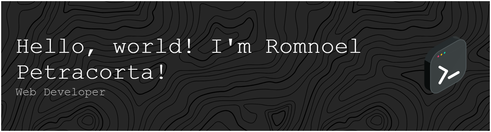

<table>
  <tr>
    <td valign="top" width="55%">

I'm a passionate programmer and a web developer. My journey into tech began with a love for video games starting with Dark Souls. That curiosity about how games are built sparked my interest in programming, eventually leading me to pursue my Computer Science degree at New Era University.

## Education

**Elementary**
- FEU Roosevelt Rodriguez (Formerly known as Roosevelt College Rodriguez) (2010–2013)
- San Jose Elementary School (2013–2016)

**Highschool**
- San Jose National High School (2016–2020)

**Senior Highschool**
- Valley High Academy (2020–2022)

**College**
- *BS in Computer Science*
- New Era University (2022–Present)

  </td>
    <td valign="top">
      
    </td>
  </tr>
</table>

## Certifications

<table width="100%">
  <tr>
    <th>Certification</th>
    <th>Issued By</th>
  </tr>
  <tr>
    <td><a href="https://www.credly.com/badges/61d618ea-6f4a-4dad-b309-95d2ae004eb4">Introduction to IoT</a></td>
    <td>Cisco</td>
  </tr>
  <tr>
    <td><a href="https://www.credly.com/badges/03a3e2f1-2808-43d7-bc97-40aeb5385e93">Computer Hardware Basics</a></td>
    <td>Cisco</td>
  </tr>
  <tr>
    <td><a href="https://www.credly.com/badges/6c733cf3-1825-4393-8138-af4a9769dd9b">Introduction to Cybersecurity</a></td>
    <td>Cisco</td>
  </tr>
  <tr>
    <td><a href="https://www.credly.com/badges/3310a7e8-0515-494d-ab83-47afb62312e3/public_url">Introduction to Data Science</a></td>
    <td>Cisco</td>
  </tr>
  <tr>
    <td><a href="https://www.credly.com/badges/e1272467-20ce-4b64-a361-a07d3171254f/public_url">Data Science Tools</a></td>
    <td>IBM</td>
  </tr>
  <tr>
    <td><a href="https://courses.cognitiveclass.ai/certificates/b6b530cd67e74fc7826e640ebbe05917">SQL and Relational Databases 101</a></td>
    <td>IBM Cognitive Class</td>
  </tr>
  <tr>
    <td><a href="https://coursera.org/share/e9149bb5a0be9d81f5d4f91177deab46">Getting Started in Google Analytics</a></td>
    <td>Coursera</td>
  </tr>
  <tr>
    <td><a href="https://coursera.org/share/ff2d73bef36fe65b7b2edc02da61e01d">Analyze Website Visitors with Google Analytics Segments</a></td>
    <td>Coursera</td>
  </tr>
  <tr>
    <td><a href="https://catalog-education.oracle.com/pls/certview/sharebadge?id=2D0C5AEEEB45095D294ED35244D18FB29C5477429B89B7211E228D1955F52165">Cloud Infrastructure 2023 AI Certified Foundations Associate</a></td>
    <td>Oracle</td>
  </tr>
  <tr>
    <td><a href="https://catalog-education.oracle.com/pls/certview/sharebadge?id=B8F41C851BD8553F6058123B4367EA78B6F275544FB7F8DF3FAE5BFB0BEFB8A5">Cloud Data Management 2023 Certified Foundations Associate</a></td>
    <td>Oracle</td>
  </tr>
  <tr>
    <td><a href="https://catalog-education.oracle.com/pls/certview/sharebadge?id=CE2DF586021BE01DACB83ABBA121CFE4A4A3D6E3280651AC5EFC375FEEBDB4A2">Cloud Infrastructure 2023 Certified Foundations Associate</a></td>
    <td>Oracle</td>
  </tr>
</table>

## 𝚁𝚎𝚌𝚎𝚗𝚝 𝙶𝚒𝚝𝚑𝚞𝚋 𝙰𝚌𝚝𝚒𝚟𝚒𝚝𝚢:
I do tend to be often busy, but I'll be sure to make time for development.
<!--RECENT_ACTIVITY:start-->
1. ⬆️ Pushed undefined commit(s) to [romnoelp/romnoelp](https://github.com/romnoelp/romnoelp) 
2. ⬆️ Pushed undefined commit(s) to [romnoelp/Cerebro](https://github.com/romnoelp/Cerebro) 
3. ⬆️ Pushed undefined commit(s) to [romnoelp/Cerebro](https://github.com/romnoelp/Cerebro) 
4. ⬆️ Pushed undefined commit(s) to [romnoelp/Cerebro](https://github.com/romnoelp/Cerebro) 
5. ⬆️ Pushed undefined commit(s) to [romnoelp/Cerebro](https://github.com/romnoelp/Cerebro) 
<!--RECENT_ACTIVITY:end-->

<!--RECENT_ACTIVITY:last_update-->
Last Updated: Saturday, May 2nd, 2026, 1:04:28 PM
<!--RECENT_ACTIVITY:last_update_end-->

## How to reach me:
You can reach me at the email in my GitHub profile, or through my socials below!

  
  
  
  

## Additional Information:
- 🌱 I'm currently learning **Vue JS, Full Stack development, and programming in general**
- 💬 Ask me about **Game dev, Java, C#, and JS**
- ⚡ Fun fact **I enjoy going to the gym, and playing with guitars!**

<h3 align="center">Languages and Tools:</h3>

  

